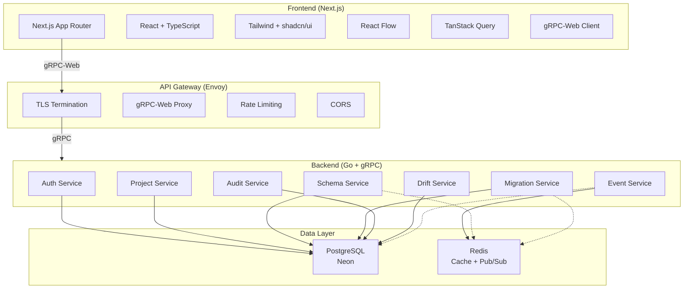
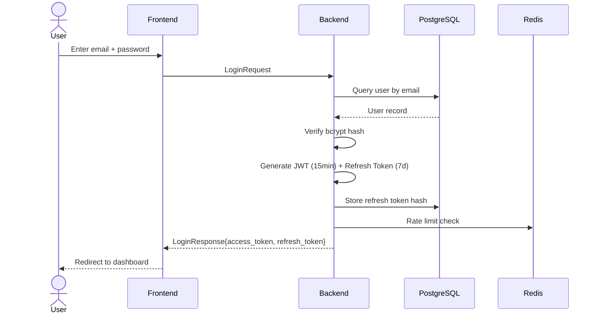
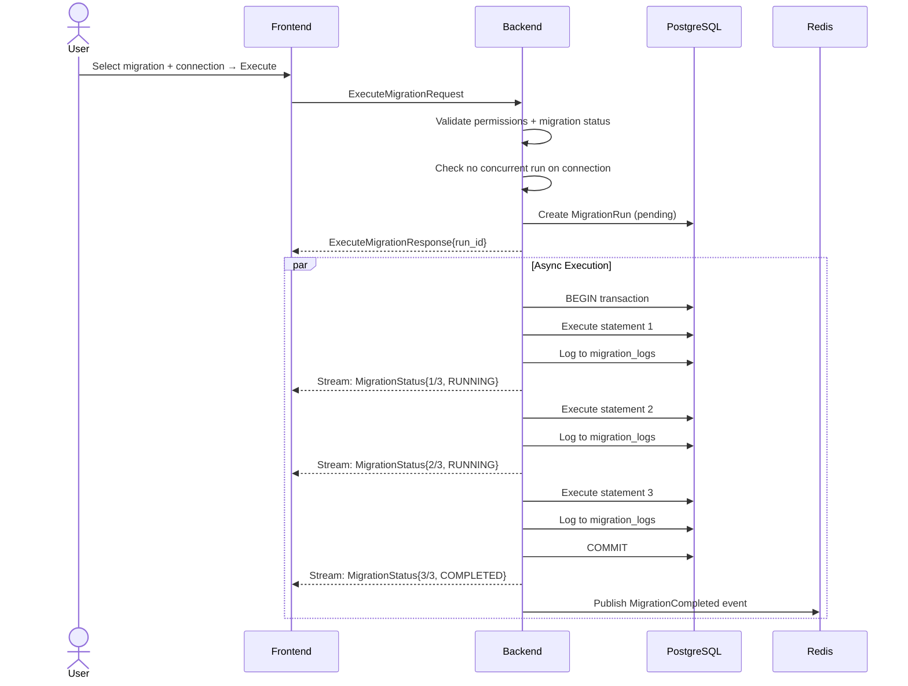
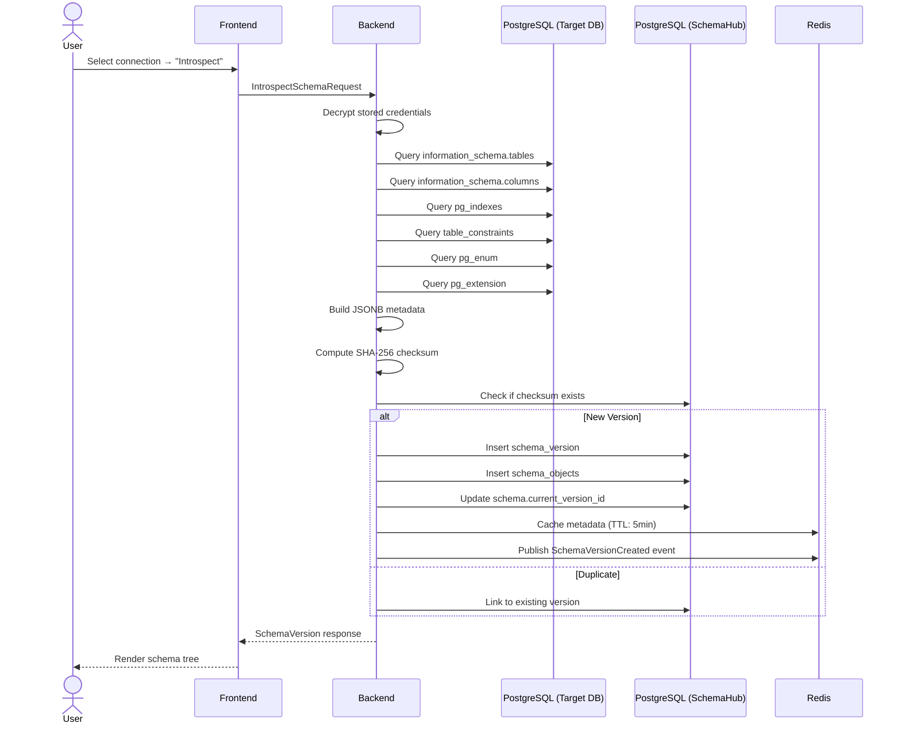

# SchemaHub

> **"GitHub for Database Schemas"** — Centralized, version-controlled, collaborative PostgreSQL schema management.

SchemaHub is a production-grade developer platform for backend engineers and DBAs to manage database schemas with the same rigor as source code on GitHub. Track every change, review every migration, audit every operation.

---

## Tech Stack


---

## Architecture



---

## Features

| Feature | Description |
|---|---|
| **Project Management** | Create projects, manage members, set roles (owner/admin/member/viewer) |
| **Connection Management** | Store encrypted DB credentials, async connectivity testing |
| **Schema Exploration** | Browse tables, columns, indexes, constraints via PostgreSQL introspection |
| **Schema Versioning** | Content-addressed immutable versions with SHA-256 checksum dedup |
| **Schema Diff** | Side-by-side comparison of any two schema versions |
| **Schema Diagrams** | Interactive ERD diagrams via React Flow with Dagre layout |
| **Migration Engine** | Create, validate, execute, and roll back SQL migrations |
| **Progress Streaming** | Real-time migration status via gRPC server-streaming |
| **Validation Engine** | Pre-execution SQL validation with disallowed statement detection |
| **Dry-Run** | Test migrations against live DB without committing changes |
| **Rollback Support** | Execute down SQL with full history and failure handling |
| **Version Timeline** | Visual history of schema changes |
| **Real-Time Events** | Live notifications via Redis pub/sub + gRPC streams |
| **Presence Tracking** | Online user indicators with heartbeat management |
| **Event Replay** | Reconnection recovery with last-event-id |
| **Audit Logging** | Immutable, partitioned, filterable audit trail for every operation |
| **Drift Detection** | Automated comparison of live DB vs tracked schema version |
| **Drift Alerting** | Periodic drift checks with severity classification |
| **RBAC** | Two-level authorization: global roles + project roles |
| **OAuth Login** | Google, GitHub, Slack social login with PKCE + account linking |

---

## User Flows

### Authentication Flow



### Migration Execution Flow



### Schema Introspection Flow



---

## Project Structure

```
schemahub/
├── frontend/          # Next.js application (App Router)
│   └── src/
│       ├── app/       # Route groups, pages, layouts
│       ├── components/# Reusable UI components
│       ├── lib/       # gRPC clients, hooks, utilities
│       └── styles/    # Tailwind config, global CSS
├── backend/           # Go mono-repo (7 services)
│   ├── cmd/server/    # Entry point with DI wiring
│   ├── internal/      # Domain logic, repos, handlers
│   │   ├── auth/      # Authentication + OAuth (Google/GitHub/Slack)
│   │   ├── project/   # Projects, members, connections
│   │   ├── schema/    # Introspection, versioning, diff, diagrams
│   │   ├── migration/ # Execution, validation, rollback, streaming
│   │   ├── event/     # Redis pub/sub, subscriptions, presence
│   │   ├── audit/     # Immutable partitioned audit logs
│   │   ├── drift/     # Drift detection, alerting, resolution
│   │   └── pkg/       # Shared: config, DB, JWT, interceptor, RBAC, workers
│   ├── proto/         # Generated protobuf Go code
│   └── pkg/encryption/# AES-256-GCM credential encryption
├── proto/             # Source .proto files (service contracts)
├── docker/            # Compose + Dockerfiles + Envoy + Redis
├── scripts/           # PowerShell dev tooling (7 scripts)
├── .github/           # CI/CD workflows + Dependabot
└── docs/              # 20 documentation files
```

---

## Quick Start

```bash
# Prerequisites: Go 1.22+, Node 20+, Docker

# Start full stack
docker compose -f docker/docker-compose.yml -f docker/docker-compose.dev.yml up

# Or use scripts
.\scripts\setup.ps1        # Check prerequisites, install tools
.\scripts\dev.ps1           # Start dev environment
.\scripts\lint.ps1          # Run all linters
.\scripts\test.ps1          # Run all tests
.\scripts\gen-proto.ps1     # Regenerate protobuf code
```

---

## Services

| Service | Role | RPCs |
|---|---|---|
| **Auth** | Register, login, JWT, OAuth | 15 |
| **Project** | Project CRUD, members, connections | 15 |
| **Schema** | Introspection, versions, diff, diagrams | 10 |
| **Migration** | CRUD, execute, rollback, validate, dry-run, streaming | 13 |
| **Event** | Subscribe, heartbeat, acknowledge | 3 |
| **Audit** | List, get, tail stream, stats | 4 |
| **Drift** | Check, list, resolve, stats | 5 |
| **Total** | | **65 gRPC RPCs** |

---

## Documentation

| Document | Description |
|---|---|
| [Project Context](docs/PROJECT_CONTEXT.md) | Vision, goals, terminology, design decisions |
| [Architecture](docs/ARCHITECTURE.md) | System architecture, request lifecycle, event flow |
| [Tech Stack](docs/TECH_STACK.md) | Technology choices with trade-off analysis |
| [Database Design](docs/DATABASE_DESIGN.md) | Complete schema design, indexes, relationships |
| [ER Diagram](docs/ER_DIAGRAM.md) | Entity-relationship visualization (Mermaid) |
| [gRPC Design](docs/GRPC_DESIGN.md) | gRPC architecture, streaming, error handling |
| [Protobuf Contracts](docs/PROTOBUF_CONTRACTS.md) | Service definitions, messages, versioning |
| [API Flow](docs/API_FLOW.md) | End-to-end request flows for every feature |
| [Authentication](docs/AUTHENTICATION.md) | JWT, refresh tokens, RBAC, token security |
| [OAuth Integration](docs/OAUTH_INTEGRATION.md) | Google/GitHub/Slack, PKCE, account linking |
| [Real-Time Architecture](docs/REALTIME_ARCHITECTURE.md) | Streaming, presence, notifications |
| [Folder Structure](docs/FOLDER_STRUCTURE.md) | Repository layout with explanations |
| [Coding Guidelines](docs/CODING_GUIDELINES.md) | Go/TS style, naming, error handling |
| [Feature Specifications](docs/FEATURE_SPECIFICATIONS.md) | 14 features with workflows |
| [Roadmap](docs/ROADMAP.md) | 9-phase development plan |
| [Security](docs/SECURITY.md) | Auth, secrets, rate limiting, transport security |
| [Deployment](docs/DEPLOYMENT.md) | Docker, env vars, CI/CD, monitoring |
| [Testing Strategy](docs/TESTING_STRATEGY.md) | Unit, integration, e2e, performance |
| [Remaining Work](docs/REMAINING.md) | Current completion audit |

---

## License

MIT
