# Entity-Relationship Diagram

> **Visual entity-relationship diagram for the SchemaHub database schema.**

---

## Table of Contents

- [Complete ER Diagram](#complete-er-diagram)
- [User Domain](#user-domain)
- [Project Domain](#project-domain)
- [Connection Domain](#connection-domain)
- [Schema Domain](#schema-domain)
- [Migration Domain](#migration-domain)
- [Audit Domain](#audit-domain)

---

## Complete ER Diagram

```mermaid
erDiagram
    %% User Domain
    users {
        uuid id PK
        varchar email UK
        varchar password_hash
        varchar display_name
        varchar avatar_url
        enum role
        bool is_active
        timestamptz email_verified_at
        timestamptz last_login_at
        timestamptz created_at
        timestamptz updated_at
        timestamptz deleted_at
    }

    refresh_tokens {
        uuid id PK
        uuid user_id FK
        varchar token_hash UK
        timestamptz expires_at
        timestamptz revoked_at
        timestamptz created_at
        inet created_by_ip
        varchar family
    }

    email_verifications {
        uuid id PK
        uuid user_id FK
        varchar token_hash
        timestamptz expires_at
        timestamptz verified_at
        timestamptz created_at
    }

    %% Project Domain
    projects {
        uuid id PK
        varchar name
        varchar slug UK
        text description
        enum visibility
        uuid created_by FK
        timestamptz created_at
        timestamptz updated_at
        timestamptz deleted_at
    }

    project_members {
        uuid id PK
        uuid project_id FK
        uuid user_id FK
        enum role
        uuid invited_by FK
        timestamptz joined_at
        timestamptz created_at
    }

    %% Connection Domain
    connections {
        uuid id PK
        uuid project_id FK
        varchar name
        varchar host
        integer port
        varchar database_name
        varchar username
        text password_encrypted
        enum ssl_mode
        enum connection_status
        timestamptz last_connected_at
        uuid created_by FK
        timestamptz created_at
        timestamptz updated_at
        timestamptz deleted_at
    }

    %% Schema Domain
    schemas {
        uuid id PK
        uuid project_id FK
        uuid connection_id FK
        varchar schema_name
        uuid current_version_id FK
        timestamptz last_introspected_at
        timestamptz created_at
        timestamptz updated_at
        timestamptz deleted_at
    }

    schema_versions {
        uuid id PK
        uuid schema_id FK
        integer version
        varchar checksum
        jsonb metadata
        integer object_count
        uuid parent_version_id FK
        uuid created_by FK
        timestamptz created_at
    }

    schema_objects {
        uuid id PK
        uuid schema_version_id FK
        enum object_type
        varchar object_name
        varchar object_schema
        jsonb definition
        uuid parent_object_id FK
    }

    %% Migration Domain
    migrations {
        uuid id PK
        uuid project_id FK
        varchar title
        text description
        varchar version
        text up_sql
        text down_sql
        varchar checksum
        enum status
        uuid created_by FK
        timestamptz created_at
        timestamptz updated_at
        timestamptz deleted_at
    }

    migration_runs {
        uuid id PK
        uuid migration_id FK
        uuid connection_id FK
        enum direction
        enum status
        timestamptz started_at
        timestamptz completed_at
        integer duration_ms
        text error_message
        uuid executed_by FK
        timestamptz created_at
    }

    migration_logs {
        uuid id PK
        uuid migration_run_id FK
        integer sequence
        text sql
        integer duration_ms
        integer rows_affected
        text error_message
        timestamptz created_at
    }

    %% Drift Domain
    drift_events {
        uuid id PK
        uuid connection_id FK
        uuid schema_id FK
        uuid expected_version_id FK
        enum drift_type
        varchar object_type
        varchar object_name
        jsonb expected_definition
        jsonb actual_definition
        text diff_summary
        enum severity
        enum status
        timestamptz detected_at
        timestamptz resolved_at
        uuid resolved_by FK
    }

    %% Audit Domain
    audit_logs {
        uuid id PK
        varchar event_type
        uuid actor_id FK
        varchar actor_email
        varchar action
        varchar resource_type
        uuid resource_id
        jsonb resource_changes
        jsonb metadata
        inet ip_address
        text user_agent
        uuid trace_id
        timestamptz created_at
    }

    %% Relationships
    users ||--o{ refresh_tokens : "has"
    users ||--o{ email_verifications : "verifies"
    users ||--o{ projects : "creates"
    users ||--o{ project_members : "member of"
    users ||--o{ connections : "manages"
    users ||--o{ schema_versions : "creates"
    users ||--o{ migrations : "authors"
    users ||--o{ migration_runs : "executes"
    users ||--o{ drift_events : "resolves"

    projects ||--o{ project_members : "has"
    projects ||--o{ connections : "contains"
    projects ||--o{ schemas : "contains"
    projects ||--o{ migrations : "has"

    connections ||--o{ schemas : "tracks"
    connections ||--o{ migration_runs : "target"
    connections ||--o{ drift_events : "monitors"

    schemas ||--o{ schema_versions : "has versions"
    schemas ||--o{ drift_events : "has"

    schema_versions ||--o{ schema_objects : "contains"
    schema_versions ||--o| schemas : "current version"

    migrations ||--o{ migration_runs : "has runs"

    migration_runs ||--o{ migration_logs : "has logs"
```



---

## User Domain

```
users 1────────N refresh_tokens
users 1────────N email_verifications
users 1────────N projects (created_by)
users 1────────N project_members
users 1────────N connections (created_by)
users 1────────N schema_versions (created_by)
users 1────────N migrations (created_by)
users 1────────N migration_runs (executed_by)
```

**Purpose:** The user domain handles authentication, identity, and session management. Users are the actors behind every operation in the system. Every mutation operation records the acting user for audit purposes.

---

## Project Domain

```
projects 1────────N project_members
projects 1────────N connections
projects 1────────N schemas
projects 1────────N migrations
```

**Purpose:** Projects provide organizational grouping and access control boundaries. All resources (connections, schemas, migrations) belong to a project. Membership controls who can access each project and at what permission level.

---

## Connection Domain

```
connections N────────1 projects
connections 1────────N schemas
connections 1────────N migration_runs
connections 1────────N drift_events
```

**Purpose:** Connections store the information needed to connect to a target PostgreSQL database. They are the bridge between SchemaHub and the managed database. Passwords are encrypted at rest.

---

## Schema Domain

```
schemas         1────────N schema_versions
schema_versions 1────────N schema_objects
schemas         1────────1 schema_versions (current_version)
                             (self-reference via parent_version_id)
```

**Purpose:** The schema domain is the core of SchemaHub. Schemas are introspected from connected databases, versioned immutably, and broken down into individual objects (tables, columns, indexes, etc.) for granular querying and comparison.

---

## Migration Domain

```
migrations      1────────N migration_runs
migration_runs  1────────N migration_logs
```

**Purpose:** Migrations represent intentional schema changes. Each migration can be run multiple times against different connections or environments. Every execution produces a run record with per-statement logs for full observability.

---

## Audit Domain

```
audit_logs (standalone — references many entities by resource_id and resource_type)
```

**Purpose:** The audit log is an append-only record of all state-changing operations. It uses polymorphic references (resource_type + resource_id) to reference any entity in the system. The table is partitioned by month for query performance and data management.

### Entity Reference Summary

| Entity | Referenced By | References |
|---|---|---|
| users | refresh_tokens, email_verifications, project_members, connections, schema_versions, migrations, migration_runs, drift_events, audit_logs | — |
| projects | project_members, connections, schemas, migrations | users (created_by) |
| connections | schemas, migration_runs, drift_events | projects, users (created_by) |
| schemas | schema_versions, drift_events | projects, connections, schema_versions (current) |
| schema_versions | schema_objects, schemas (current), drift_events | schemas, schema_versions (parent), users |
| schema_objects | — | schema_versions, schema_objects (parent) |
| migrations | migration_runs | projects, users (created_by) |
| migration_runs | migration_logs | migrations, connections, users |
| drift_events | — | connections, schemas, schema_versions, users |
| audit_logs | — | users (actor — nullable) |
