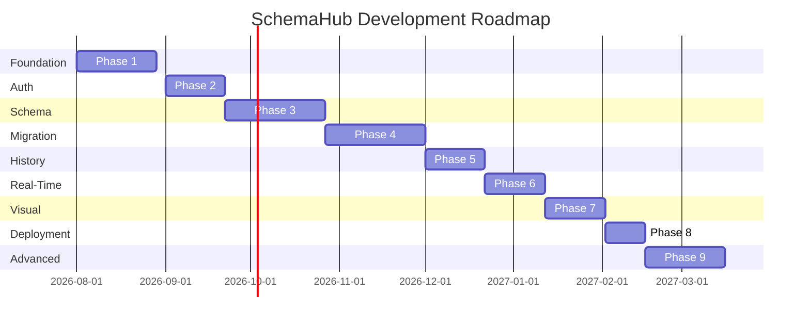

# Roadmap

> **Phased development plan for SchemaHub from foundation to advanced features.**

---

## Table of Contents

- [Development Phases Overview](#development-phases-overview)
- [Phase 1: Foundation](#phase-1-foundation)
- [Phase 2: Authentication](#phase-2-authentication)
- [Phase 3: Schema Explorer](#phase-3-schema-explorer)
- [Phase 4: Migration Engine](#phase-4-migration-engine)
- [Phase 5: Version History](#phase-5-version-history)
- [Phase 6: Real-Time Features](#phase-6-real-time-features)
- [Phase 7: Visual Schema Explorer](#phase-7-visual-schema-explorer)
- [Phase 8: Deployment](#phase-8-deployment)
- [Phase 9: Advanced Features](#phase-9-advanced-features)

---

## Development Phases Overview

---

## Phase 1: Foundation

**Duration:** 4 weeks
**Objective:** Set up the complete development infrastructure and foundational code.

### Deliverables

| Deliverable | Description |
|---|---|
| **Repository setup** | Go module, Next.js project, proto workspace |
| **Docker environment** | docker-compose with backend, frontend, redis |
| **Build toolchain** | Makefile, proto generation scripts, linter config |
| **Database schema** | PostgreSQL migrations for all tables |
| **Shared libraries** | Config loading, logger, error handling, gRPC interceptors |
| **CI pipeline** | GitHub Actions for lint, test, build |
| **Documentation** | All docs in finalized state |

### Dependencies

- None (foundation phase)

### Risks

| Risk | Mitigation |
|---|---|
| Docker setup complexity | Use well-known images, minimize custom Dockerfiles |
| Proto toolchain issues | Use `buf` for consistent proto management |

### Complexity: Medium

---

## Phase 2: Authentication

**Duration:** 3 weeks
**Objective:** Implement user registration, login, JWT management, and RBAC.

### Deliverables

| Deliverable | Description |
|---|---|
| **Auth Service** | Registration, login, logout, token refresh |
| **JWT implementation** | RS256 signing, access/refresh token lifecycle |
| **RBAC system** | Global roles, project roles, permission checks |
| **User management** | Profile CRUD, password change, email verification |
| **Auth interceptors** | Token validation, permission checking |
| **Frontend auth** | Login/register pages, auth provider, token management |

### Dependencies

- Phase 1 (foundation)

### Risks

| Risk | Mitigation |
|---|---|
| Token security | Short TTL, rotation, family revocation |
| bcrypt performance | Cost factor 12, async hashing |

### Complexity: Medium

---

## Phase 3: Schema Explorer

**Duration:** 5 weeks
**Objective:** Connect databases, introspect schemas, and browse schema structure.

### Deliverables

| Deliverable | Description |
|---|---|
| **Connection management** | CRUD, credential encryption, test connection |
| **Project Service** | Project CRUD, member management |
| **Schema Service** | Introspection engine, schema versioning |
| **PostgreSQL introspection** | Tables, columns, indexes, constraints, enums |
| **Schema browsing UI** | Tree view, detail panels, search |
| **Schema versioning** | Content-addressed versions, checksum dedup |
| **Frontend schema explorer** | Schema tree component, detail panels |

### Dependencies

- Phase 2 (authentication for API access)

### Risks

| Risk | Mitigation |
|---|---|
| Large schema introspection performance | Streaming, parallel queries, paginated results |
| PostgreSQL catalog complexity | Support common objects first (tables, views, indexes); extend later |

### Complexity: High

---

## Phase 4: Migration Engine

**Duration:** 5 weeks
**Objective:** Create, validate, execute, and roll back database migrations.

### Deliverables

| Deliverable | Description |
|---|---|
| **Migration Service** | CRUD for migrations, version management |
| **Migration executor** | SQL execution engine, transaction management |
| **SQL validator** | Parse and validate SQL before execution |
| **Migration runner UI** | Execute/dry-run/rollback controls |
| **Migration logs** | Per-statement logging, execution history |
| **Progress streaming** | Real-time migration status updates |
| **Rollback support** | Execute down migrations, failure handling |
| **Validation engine** | Pre-execution validation checks |

### Dependencies

- Phase 3 (schemas needed for context)

### Risks

| Risk | Mitigation |
|---|---|
| SQL injection | Parameterized queries, prepared statements |
| Long-running migrations | Streaming progress, timeout configuration |
| Migration failure | Automatic transaction rollback, clear error reporting |

### Complexity: High

---

## Phase 5: Version History

**Duration:** 3 weeks
**Objective:** Compare schema versions and view migration history.

### Deliverables

| Deliverable | Description |
|---|---|
| **Schema diff engine** | Compare two schema versions, compute added/removed/modified |
| **Diff viewer UI** | Side-by-side comparison, highlighted changes |
| **Version timeline** | Visual timeline of schema versions |
| **Migration history UI** | List, filter, and search historical migrations |
| **Audit log viewer** | Filterable, searchable audit trail |

### Dependencies

- Phase 3 (schema versions)
- Phase 4 (migration history)

### Risks

| Risk | Mitigation |
|---|---|
| Diff performance on large schemas | Object-level diffing, lazy column resolution |

### Complexity: Low-Medium

---

## Phase 6: Real-Time Features

**Duration:** 3 weeks
**Objective:** Implement real-time event streaming, notifications, and presence.

### Deliverables

| Deliverable | Description |
|---|---|
| **Event Service** | Server-streaming gRPC for event delivery |
| **Redis pub/sub** | Channel-based event distribution |
| **Subscription manager** | Per-client subscriptions, event filtering |
| **Reconnection replay** | Missed event recovery on reconnect |
| **Presence tracking** | Online user indicators, heartbeat management |
| **Frontend streaming** | WebSocket hook, real-time UI updates |
| **Notifications** | In-app notification stream |

### Dependencies

- Phase 4 (migration events)
- Phase 3 (schema events)

### Risks

| Risk | Mitigation |
|---|---|
| Connection management | Graceful disconnection, heartbeat timeout |
| Event delivery guarantees | At-least-once delivery, replay on reconnect |

### Complexity: Medium

---

## Phase 7: Visual Schema Explorer

**Duration:** 3 weeks
**Objective:** Interactive ERD diagrams using React Flow.

### Deliverables

| Deliverable | Description |
|---|---|
| **Diagram data service** | Compute nodes/edges from schema metadata |
| **Layout algorithm** | Dagre-based automatic layout |
| **React Flow integration** | Interactive diagram component |
| **Table detail popups** | Click-to-expand table details in diagram |
| **Relationship visualization** | Foreign key edges with labels |
| **Diagram interaction** | Pan, zoom, filter, highlight |
| **Export diagram** | PNG/SVG export |

### Dependencies

- Phase 3 (schema objects, relationships)

### Risks

| Risk | Mitigation |
|---|---|
| Layout complexity for 100+ tables | Paginated diagrams, schema filtering |
| React Flow performance | Virtualization for large diagrams |

### Complexity: Medium-High

---

## Phase 8: Deployment

**Duration:** 2 weeks
**Objective:** Set up production infrastructure, CI/CD, and monitoring.

### Deliverables

| Deliverable | Description |
|---|---|
| **Production Docker Compose** | Multi-service deployment config |
| **CI/CD pipeline** | Automated build, test, deploy |
| **Neon database setup** | Production database provisioning |
| **Redis setup** | Production Redis configuration |
| **Environment configuration** | Dev/staging/prod environment separation |
| **Monitoring** | Prometheus metrics, Grafana dashboards |
| **Logging** | Centralized log collection |
| **Backup strategy** | Database backup and restore procedures |

### Dependencies

- All feature phases

### Risks

| Risk | Mitigation |
|---|---|
| Environment drift | Infrastructure as Code (Terraform) |
| Secrets management | Environment variables, secret manager |

### Complexity: Medium

---

## Phase 9: Advanced Features

**Duration:** 4 weeks
**Objective:** Drift detection, CLI tool, and enhanced capabilities.

### Deliverables

| Deliverable | Description |
|---|---|
| **Drift detection service** | Automated schema comparison, drift events |
| **Drift alerting** | Notification on drift detection |
| **Drift dashboard** | Visual drift summary, resolution workflow |
| **CLI tool (v1)** | Schema push/pull, migration execution from CLI |
| **Migration validation enhancements** | Breaking change detection, impact analysis |
| **Performance optimizations** | Caching improvements, query optimization |
| **Load testing** | k6 test suites, performance baseline |

### Dependencies

- Phase 3 (schema comparison)
- Phase 4 (migration execution)

### Risks

| Risk | Mitigation |
|---|---|
| Drift detection false positives | Configurable thresholds, manual acknowledge |

### Complexity: Medium-High

---

## Summary

| Phase | Duration | Complexity | Dependencies |
|---|---|---|---|
| 1: Foundation | 4 weeks | Medium | None |
| 2: Authentication | 3 weeks | Medium | Phase 1 |
| 3: Schema Explorer | 5 weeks | High | Phase 2 |
| 4: Migration Engine | 5 weeks | High | Phase 3 |
| 5: Version History | 3 weeks | Low-Medium | Phase 3, 4 |
| 6: Real-Time Features | 3 weeks | Medium | Phase 4 |
| 7: Visual Explorer | 3 weeks | Medium-High | Phase 3 |
| 8: Deployment | 2 weeks | Medium | All phases |
| 9: Advanced | 4 weeks | Medium-High | Phase 3, 4 |
| **Total** | **32 weeks** | | |
